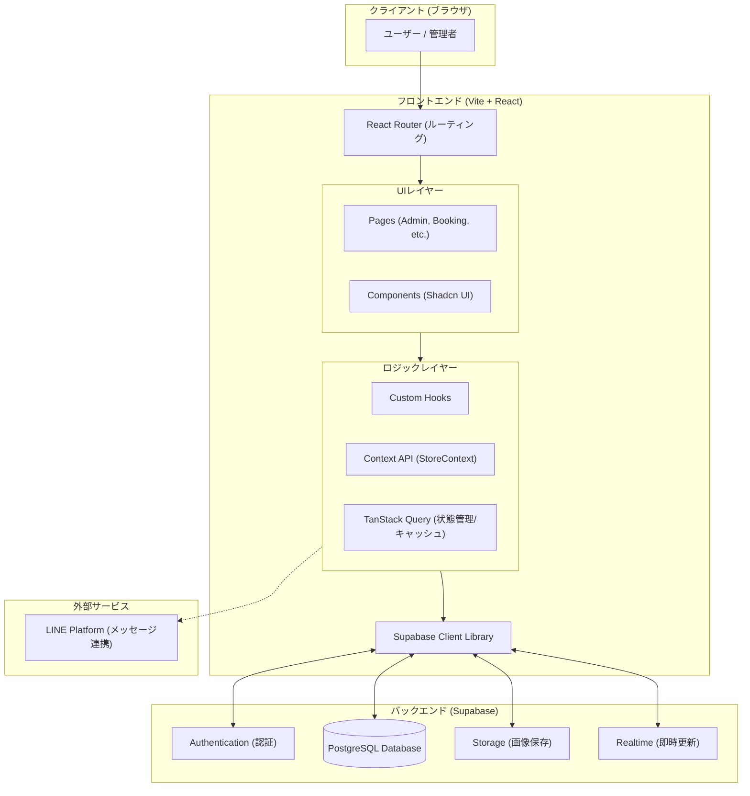

# システムアーキテクチャ図

Haukuri Proのシステム構成図です。

## アーキテクチャの概要

このアプリケーションは、**サーバーレスアーキテクチャ**を採用しており、フロントエンドに重きを置いた構成（SPA: Single Page Application）となっています。

### 1. フロントエンド (Frontend)
*   **Framework**: React + Vite
*   **Language**: TypeScript
*   **Styling**: Tailwind CSS + Shadcn UI (モダンでレスポンシブなデザイン)
*   **State Management**:
    *   **TanStack Query**: サーバーデータの取得、キャッシュ、同期を効率的に管理。
    *   **Context API**: アプリケーション全体の設定（店舗選択など）を管理。
*   **Routing**: React Routerによるクライアントサイド・ルーティング。

### 2. バックエンド (Backend - Supabase)
BaaS (Backend as a Service) である **Supabase** を全面的に採用しています。
*   **Database**: PostgreSQLを使用。リレーショナルデータ（予約、顧客、サービス、店舗など）を管理。
*   **Authentication**: ユーザー認証および管理者ログイン機能。
*   **Storage**: サービス画像や現場写真などのファイル保存。
*   **Realtime**: データベースの変更を即座にフロントエンドに反映（予約が入った瞬間に管理画面更新など）。

### 3. 外部連携 (External)
*   **LINE Platform**: 顧客とのコミュニケーションや通知機能（予定）として連携。
