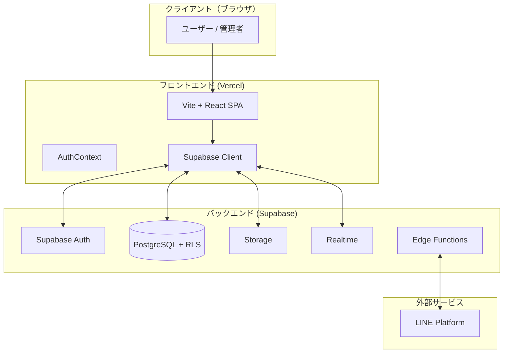

# セキュリティ・認証・インフラ ドキュメント

このドキュメントでは、Haukuri Proのインフラ構成、認証方式、およびセキュリティ対策について説明します。

---

## 概要

Haukuri Proは、**サーバーレスアーキテクチャ**を採用したモダンなWebアプリケーションです。従来のようにサーバーを自前で運用するのではなく、Supabaseというバックエンドサービス（BaaS）を活用することで、インフラ管理の手間を最小限に抑えながら、高いセキュリティと拡張性を実現しています。

### なぜこの構成なのか？

1. **開発スピード**: サーバーサイドのコードを書かずに、フロントエンドからデータベースに直接アクセスできるため、開発効率が大幅に向上します。
2. **スケーラビリティ**: Supabaseがインフラを管理するため、ユーザー数が増えても自動的にスケールします。
3. **セキュリティ**: Row Level Security（RLS）により、データベースレベルでアクセス制御を行うため、APIに脆弱性があってもデータ漏洩のリスクを軽減できます。
4. **コスト効率**: 従量課金モデルのため、小規模なうちは低コストで運用でき、成長に合わせて拡張できます。

---

## 📐 インフラ アーキテクチャ



上記の図が示すように、ユーザーのブラウザからVercelにホストされたフロントエンド（React SPA）にアクセスし、そこからSupabaseの各サービスと通信します。フロントエンドとバックエンドの間に独自のAPIサーバーは存在せず、Supabase Clientライブラリを通じて直接データベースにアクセスする構成です。

この構成の特徴は、**フロントエンド側にビジネスロジックを集中させつつ、セキュリティはデータベースレベルで担保する**という点です。従来の「APIサーバーで認可チェック」という方式とは異なり、PostgreSQLのRow Level Security（RLS）機能を活用して、不正なデータアクセスをデータベース側で遮断します。

### ホスティング構成

| レイヤー | 技術 | ホスティング |
|----------|------|-------------|
| **フロントエンド** | React + Vite + TypeScript | **Vercel** (推奨) |
| **バックエンド** | Supabase (BaaS) | **Supabase Cloud** |
| **データベース** | PostgreSQL | Supabase managed |
| **サーバーレス関数** | Supabase Edge Functions (Deno) | Supabase managed |

Vercelは静的サイトのホスティングに特化したプラットフォームで、GitHubと連携することでプッシュのたびに自動デプロイされます。Supabaseはデータベース、認証、ストレージ、リアルタイム通信をオールインワンで提供するサービスです。どちらもマネージドサービスのため、サーバーの運用保守は不要です。

---

## 🔐 認証 (Authentication)

認証とは、「このユーザーは誰なのか」を確認する仕組みです。Haukuri Proでは**Supabase Auth**という認証サービスを利用しています。これはGoogleやFacebookなどの大手サービスと同様のOAuth2/JWT方式を採用しており、業界標準のセキュリティレベルを提供します。

認証状態の管理は `src/contexts/AuthContext.tsx` で行っており、アプリ全体でログイン状態を共有できるようになっています。

### 対応認証方式

| 認証方式 | 実装状況 | 実装箇所 |
|----------|----------|----------|
| **Email/Password** | ✅ 実装済み | `supabase.auth.signInWithPassword` |
| **Google OAuth** | ✅ 実装済み | `supabase.auth.signInWithOAuth({ provider: 'google' })` |
| **LINE OAuth** | 📋 計画中 | PRDに記載 |
| **パスワードリセット** | ✅ 実装済み | Supabase Auth 標準機能 |

**Email/Password認証**は従来型のログイン方式で、ユーザーがメールアドレスとパスワードを入力してログインします。**Google OAuth**はGoogleアカウントでワンクリックログインできる方式で、パスワード管理の手間がなくユーザー体験が向上します。

### 認証フロー

ユーザーがログインすると、以下の流れで認証が行われます：

1. **ログイン試行**: ユーザーが認証情報（メール/パスワード or Googleアカウント）を送信
2. **トークン発行**: Supabase Authが認証情報を検証し、正しければJWT（JSON Web Token）を発行
3. **セッション保存**: JWTをブラウザの`localStorage`に保存し、ページをリロードしてもログイン状態を維持
4. **自動リフレッシュ**: JWTの有効期限が近づくと、自動的に新しいトークンを取得
5. **組織情報取得**: ログイン後、`AuthContext`がユーザーの所属組織（`organization_id`）を取得し、適切なデータ範囲を設定

この仕組みにより、ユーザーはブラウザを閉じても次回アクセス時に自動的にログイン状態が復元されます。

### Supabase Edge Functions

Edge Functionsは、サーバーサイドで実行する必要がある処理（外部APIとの連携など）を担当します。フロントエンドから直接呼び出せないAPIキーを使う処理や、Webhook（外部サービスからの通知受信）の処理に使用します。

| 関数名 | 用途 |
|--------|------|
| `line-webhook` | LINEからのWebhook（メッセージ受信など）を処理 |
| `send-line-message` | LINEユーザーにメッセージを送信 |
| `booking-assistant` | 予約に関するアシスタント機能 |

---

## 🛡️ セキュリティ - Row Level Security (RLS)

### RLSとは何か？

Row Level Security（行レベルセキュリティ）は、**PostgreSQLの組み込み機能**で、テーブル内の各行に対してアクセス制御を行う仕組みです。

従来のWebアプリケーションでは、APIサーバー側で「このユーザーはこのデータにアクセスしていいか？」を判定していました。しかし、APIに脆弱性（バグやセキュリティホール）があると、不正なデータアクセスが可能になってしまいます。

RLSは**データベース層でアクセス制御を行う**ため、たとえフロントエンドやAPIに問題があっても、データベースが最後の砦として不正アクセスを防ぎます。これは「深層防御（Defense in Depth）」の考え方に基づいた設計です。

### マルチテナントとは？

このシステムは**マルチテナント**アーキテクチャを採用しています。マルチテナントとは、1つのアプリケーションで複数の組織（会社・店舗）のデータを管理する方式です。

例えば、ハウスクリーニング会社Aと会社Bが同じHaukuri Proを使っている場合、お互いの顧客データや予約データは絶対に見えてはいけません。この「データ分離」をRLSで実現しています。

### マルチテナントの仕組み

- 各テーブルに `organization_id` カラムを設置し、どの組織のデータかを識別
- ユーザーは `profiles` テーブルを通じて所属組織に紐付け
- RLSポリシーにより、ユーザーは自分の所属組織のデータのみアクセス可能

### 主要テーブルのRLSポリシー一覧

#### organizations テーブル

| ポリシー名 | 操作 | 条件 |
|-----------|------|------|
| Users can view own organization | SELECT | 自分の所属組織のみ |

#### profiles テーブル

| ポリシー名 | 操作 | 条件 |
|-----------|------|------|
| Users can view profiles in own organization | SELECT | 同一組織 or 自分自身 |

#### customers テーブル

| ポリシー名 | 操作 | 条件 |
|-----------|------|------|
| Users can view own org customers | SELECT | 同一組織のデータのみ |
| Users can create customers for own org | INSERT | 同一組織のデータのみ |
| Users can update own org customers | UPDATE | 同一組織のデータのみ |
| Users can delete own org customers | DELETE | 同一組織のデータのみ |
| Anyone can create customers with org | INSERT | 公開予約フォーム用 |

#### bookings テーブル

| ポリシー名 | 操作 | 条件 |
|-----------|------|------|
| Users can view own org bookings | SELECT | 同一組織のデータのみ |
| Users can create bookings for own org | INSERT | 同一組織のデータのみ |
| Users can update own org bookings | UPDATE | 同一組織のデータのみ |
| Users can delete own org bookings | DELETE | 同一組織のデータのみ |
| Public can create bookings | INSERT | 公開予約フォーム用（誰でも可） |

#### services / service_options テーブル

| ポリシー名 | 操作 | 条件 |
|-----------|------|------|
| Anyone can view services | SELECT | 公開（予約ページ表示用） |
| Users can manage own org services | ALL | 編集は同一組織のみ |

### RLSポリシーの実装例

以下は、顧客テーブルに対するRLSポリシーの例です。このポリシーは「ユーザーは自分の所属組織の顧客データのみ閲覧できる」というルールを定義しています。

```sql
-- customers テーブルのSELECTポリシー例
CREATE POLICY "Users can view own org customers"
  ON public.customers FOR SELECT
  USING (
    organization_id IN (
      SELECT organization_id FROM public.profiles WHERE id = auth.uid()
    )
  );
```

このSQLは以下のように動作します：

1. `auth.uid()` で現在ログイン中のユーザーIDを取得
2. `profiles`テーブルからそのユーザーの`organization_id`を取得
3. `customers`テーブルの各行について、`organization_id`が一致するもののみ返す

このルールはデータベースレベルで強制されるため、フロントエンドのコードでどんなクエリを書いても、他の組織のデータにアクセスすることは物理的に不可能です。

---

## 🔑 環境変数

環境変数は、アプリケーションが動作するために必要な設定値を外部から注入する仕組みです。本番環境と開発環境で異なる値を使いたい場合（例：データベースの接続先）に便利です。

| 変数名 | 用途 | 公開可否 |
|--------|------|----------|
| `VITE_SUPABASE_URL` | Supabase プロジェクトURL | ✅ 公開可 |
| `VITE_SUPABASE_PUBLISHABLE_KEY` | Supabase Anon Key | ✅ 公開可 (RLSで保護) |
| `VITE_SUPABASE_PROJECT_ID` | プロジェクト識別子 | ✅ 公開可 |

### なぜAnon Keyを公開しても安全なのか？

「APIキーを公開して大丈夫なの？」と疑問に思うかもしれません。Supabaseには2種類のキーがあります：

1. **Anon Key（公開キー）**: ブラウザから使用するためのキー。RLSが有効な場合、このキーでアクセスできるデータはRLSポリシーで制限される
2. **Service Role Key（秘密キー）**: サーバーサイドでのみ使用。RLSをバイパスできるため、絶対に公開してはいけない

`VITE_` プレフィックスがついた環境変数はフロントエンドのビルド時に埋め込まれ、ブラウザから見えます。Anon Keyはこの目的で設計されているため、公開しても問題ありません。**ただし、Service Role Keyは絶対にフロントエンドで使用しないでください。**

---

## ✅ セキュリティチェックリスト

| 項目 | 状態 | 詳細 |
|------|------|------|
| **認証基盤** | ✅ 良好 | Supabase Auth (業界標準OAuth2/JWT) |
| **セッション管理** | ✅ 良好 | トークン自動更新・永続化 |
| **データ分離 (RLS)** | ✅ 良好 | organization_id ベースのテナント分離 |
| **公開APIの制限** | ✅ 良好 | SELECT は公開、CRUD は認証必須 |
| **HTTPS** | ✅ 自動 | Vercel/Supabase 標準で強制 |
| **CORS** | ✅ 自動 | Supabase で設定済み |

---

## ⚠️ セキュリティに関する注意事項

開発・運用時に気をつけるべきセキュリティ上の注意点をまとめます。

### 1. `.env` ファイルの管理

`.env`ファイルにはSupabaseの接続情報が含まれています。このファイルは`.gitignore`に追加し、GitHubにコミットしないでください。万が一コミットした場合は、Supabaseダッシュボードからキーをリセットしてください。

### 2. Service Role Keyの取り扱い

Service Role KeyはRLSをバイパスできる強力なキーです。これをフロントエンドのコードに含めると、すべてのデータにアクセスできる状態になってしまいます。このキーはEdge Functionsなど、サーバーサイドでのみ使用してください。

### 3. 新しいテーブル作成時のRLS設定

新しいテーブルを作成する際は、必ず以下の手順を踏んでください：

1. `ALTER TABLE テーブル名 ENABLE ROW LEVEL SECURITY;` でRLSを有効化
2. 適切なRLSポリシーを作成（デフォルトでは誰もアクセスできない状態）
3. テスト環境で動作確認

RLSを有効化し忘れると、そのテーブルは誰でもアクセス可能な状態になります。

### 4. 定期的なセキュリティ監査

Supabaseダッシュボードの「Database > Policies」セクションで、すべてのテーブルのRLSポリシーを定期的に確認してください。意図しないポリシー（例：`USING (true)` で全許可）がないかチェックしましょう。

---

## 📚 関連ドキュメント

- [システムアーキテクチャ図](./architecture.md)
- [デプロイガイド](./deployment.md)
- [技術スタック](./tech_stack.md)
- [LINE連携設定ガイド](./line_integration_guide.md)
