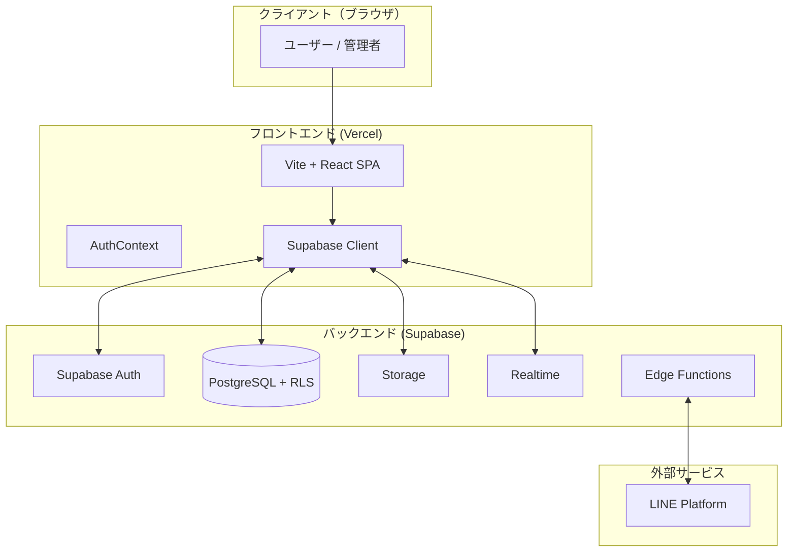

# セキュリティ・認証・インフラ ドキュメント

このドキュメントでは、Haukuri Proのインフラ構成、認証方式、およびセキュリティ対策について説明します。

## 📐 インフラ アーキテクチャ



### ホスティング構成

| レイヤー | 技術 | ホスティング |
|----------|------|-------------|
| **フロントエンド** | React + Vite + TypeScript | **Vercel** (推奨) |
| **バックエンド** | Supabase (BaaS) | **Supabase Cloud** |
| **データベース** | PostgreSQL | Supabase managed |
| **サーバーレス関数** | Supabase Edge Functions (Deno) | Supabase managed |

---

## 🔐 認証 (Authentication)

認証は **Supabase Auth** を使用しており、`src/contexts/AuthContext.tsx` で状態管理を行っています。

### 対応認証方式

| 認証方式 | 実装状況 | 実装箇所 |
|----------|----------|----------|
| **Email/Password** | ✅ 実装済み | `supabase.auth.signInWithPassword` |
| **Google OAuth** | ✅ 実装済み | `supabase.auth.signInWithOAuth({ provider: 'google' })` |
| **LINE OAuth** | 📋 計画中 | PRDに記載 |
| **パスワードリセット** | ✅ 実装済み | Supabase Auth 標準機能 |

### 認証フロー

1. ユーザーがログイン → Supabase Auth が JWT トークンを発行
2. セッションを `localStorage` に永続化 (`persistSession: true`)
3. トークンの自動リフレッシュ (`autoRefreshToken: true`)
4. `AuthContext` がユーザーの `organization_id` を取得し、テナント情報を管理

### Supabase Edge Functions

| 関数名 | 用途 |
|--------|------|
| `line-webhook` | LINE Webhookの受信処理 |
| `send-line-message` | LINEメッセージ送信 |
| `booking-assistant` | 予約アシスタント機能 |

---

## 🛡️ セキュリティ - Row Level Security (RLS)

このシステムは **マルチテナント** アーキテクチャを採用しており、**RLS (Row Level Security)** でデータ分離を実現しています。

### マルチテナントの仕組み

- 各テーブルに `organization_id` カラムを設置
- ユーザーは `profiles` テーブルを通じて所属組織に紐付け
- RLSポリシーにより、ユーザーは自分の所属組織のデータのみアクセス可能

### 主要テーブルのRLSポリシー一覧

#### organizations テーブル

| ポリシー名 | 操作 | 条件 |
|-----------|------|------|
| Users can view own organization | SELECT | 自分の所属組織のみ |

#### profiles テーブル

| ポリシー名 | 操作 | 条件 |
|-----------|------|------|
| Users can view profiles in own organization | SELECT | 同一組織 or 自分自身 |

#### customers テーブル

| ポリシー名 | 操作 | 条件 |
|-----------|------|------|
| Users can view own org customers | SELECT | 同一組織のデータのみ |
| Users can create customers for own org | INSERT | 同一組織のデータのみ |
| Users can update own org customers | UPDATE | 同一組織のデータのみ |
| Users can delete own org customers | DELETE | 同一組織のデータのみ |
| Anyone can create customers with org | INSERT | 公開予約フォーム用 |

#### bookings テーブル

| ポリシー名 | 操作 | 条件 |
|-----------|------|------|
| Users can view own org bookings | SELECT | 同一組織のデータのみ |
| Users can create bookings for own org | INSERT | 同一組織のデータのみ |
| Users can update own org bookings | UPDATE | 同一組織のデータのみ |
| Users can delete own org bookings | DELETE | 同一組織のデータのみ |
| Public can create bookings | INSERT | 公開予約フォーム用（誰でも可） |

#### services / service_options テーブル

| ポリシー名 | 操作 | 条件 |
|-----------|------|------|
| Anyone can view services | SELECT | 公開（予約ページ表示用） |
| Users can manage own org services | ALL | 編集は同一組織のみ |

### RLSポリシーの実装例

```sql
-- customers テーブルのSELECTポリシー例
CREATE POLICY "Users can view own org customers"
  ON public.customers FOR SELECT
  USING (
    organization_id IN (
      SELECT organization_id FROM public.profiles WHERE id = auth.uid()
    )
  );
```

---

## 🔑 環境変数

| 変数名 | 用途 | 公開可否 |
|--------|------|----------|
| `VITE_SUPABASE_URL` | Supabase プロジェクトURL | ✅ 公開可 |
| `VITE_SUPABASE_PUBLISHABLE_KEY` | Supabase Anon Key | ✅ 公開可 (RLSで保護) |
| `VITE_SUPABASE_PROJECT_ID` | プロジェクト識別子 | ✅ 公開可 |

> **注意**: `VITE_` プレフィックスの環境変数はブラウザに公開されます。Anon Key は公開キーですが、RLSが有効であるためセキュリティ上問題ありません。

---

## ✅ セキュリティチェックリスト

| 項目 | 状態 | 詳細 |
|------|------|------|
| **認証基盤** | ✅ 良好 | Supabase Auth (業界標準OAuth2/JWT) |
| **セッション管理** | ✅ 良好 | トークン自動更新・永続化 |
| **データ分離 (RLS)** | ✅ 良好 | organization_id ベースのテナント分離 |
| **公開APIの制限** | ✅ 良好 | SELECT は公開、CRUD は認証必須 |
| **HTTPS** | ✅ 自動 | Vercel/Supabase 標準で強制 |
| **CORS** | ✅ 自動 | Supabase で設定済み |

---

## ⚠️ セキュリティに関する注意事項

1. **`.env` ファイル**: GitHubにコミットしないでください（`.gitignore` に追加）
2. **Service Role Key**: フロントエンドで絶対に使用しないでください
3. **RLSポリシーの確認**: 新しいテーブル追加時は必ずRLSを有効化
4. **定期的な監査**: Supabase ダッシュボードでRLSポリシーを定期確認

---

## 📚 関連ドキュメント

- [システムアーキテクチャ図](./architecture.md)
- [デプロイガイド](./deployment.md)
- [技術スタック](./tech_stack.md)
- [LINE連携設定ガイド](./line_integration_guide.md)
